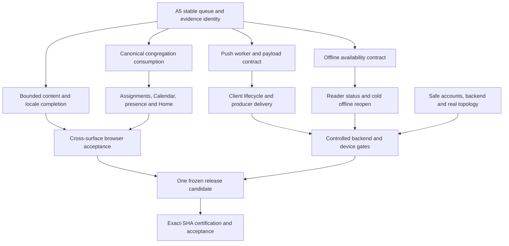

# BibleQuest V5 Astra Diagnostic Report

## 1. Executive Summary

- **Analyzed branch:** v5/feature-completion.
- **Exact application HEAD:** 4ecac545010f3c6dc1eaac950c434a4891b7b464, independently verified through branch and commit endpoints; unchanged on the final read at 2026-09-14 03:36:59 UTC (12:36:59 JST).
- **Overall diagnostic completion estimate: approximately 42%. Not release-ready.** This is a judgment-based acceptance estimate, not a test pass rate or engineering-hours estimate. The nine workstream estimates in section 3 have an unweighted mean of 41.7%; uncertainty is approximately ±10 percentage points. Missing mandatory real-environment gates prevent certification regardless of percentage.
- Current architecture remains substantially intact. No broad V6/V7 runtime migration was found in the sampled active V5 changes.
- Strongest completed areas: integrated Leader Center role-access browser gate, CEBOCB preservation/browser gate, Section E integration harness, small EN/TL localization foundation, account-aware active-congregation primitive and switcher, and push-subscription storage/RLS source.
- **Leader Center access completion should not be reopened:** its maintained member-denied/leader-allowed browser evidence was integrated. Separately, the literal acceptance checklist still asks for member/completed counts and People-view behavior beyond the current composition; that discrepancy needs an explicit authority reconciliation.
- **Push is not an integrated delivery chain.** Only subscription storage is integrated. The server sender is PR #265; client lifecycle and producer invocation are absent from the traced path. PR #201 adds handlers to the wrong worker for the current bootstrap.
- Push components also disagree on payload and routing: sender emits path/category; proposed worker reads url/type; the actual router consumes hash routes. Simply merging both PRs will not close the chain.
- **Congregation selection is not propagated:** Calendar picks the first membership, Assignments retains its own selection, presence heartbeats all memberships, and Home takes the first presence congregation. The canonical switcher cannot currently establish one coherent visible context.
- **Offline data persistence already exists.** The missing availability helper is unintegrated, Reader status is unwired, and real no-network reopen proof is missing. The helper duplicates the cache identifier/path logic and treats a malformed cache entry as available.
- **Admin security is implemented but not fully demonstrated:** owner-only email recovery and privacy-safe delete audit detail exist; session revocation and audit writes can fail without stopping a successful action response. Controlled Auth/session/audit execution remains essential.
- No examined evidence establishes a safe non-production backend with controlled identities, a populated second-congregation topology, or final push/offline device proof.
- Localization covers **97 canonical EN/TL keys**, principally shell chrome, Basic Transformation chrome, and Home chrome. This is not full Tagalog: Transformation questions/results, Home assignment subview, broader screens, and Full Transform remain untranslated through this mechanism. No Cebuano UI dictionary is integrated.
- Required Today/This Week, weekly journey, latest-completed-service semantics, and content depth remain substantial implementation work. Waiting only for field tests will not finish V5.
- **Primary throughput bottleneck:** hourly-scale serialized integration plus blanket prior-base refreshes. The observed queue contains 19 open PRs, 17 with older recorded bases; 34 of 48 recently closed V5 PRs were closed unmerged.
- Some prior-base changes have real compatibility defects, notably Media retirement versus validators and month-grid navigation versus a 30-day agenda. Others are repeatedly recreated despite unrelated integration changes.
- No Actions runs were returned for the exact analyzed integration SHA. The accumulated regression workflow automatically targets main, while important V5 gates have narrow path triggers. A green worker PR is not whole-V5 certification.
- The shortest credible path is: stabilize bounded contracts and integration evidence, finish dependent consumers and accepted content in parallel with environment setup, then freeze one candidate and run the required evidence classes once against it.
- This assignment changed only this report. No application, tests, workflows, migrations, configuration, Issues, PRs, deployment, or backend state was changed.

## 2. Repository State Verified

### Snapshot and evidence method

Repository: [11ll11l1l1l/BibleQuest](https://github.com/11ll11l1l1l/BibleQuest). Analysis reads were pinned to [4ecac545010f3c6dc1eaac950c434a4891b7b464](https://github.com/11ll11l1l1l/BibleQuest/commit/4ecac545010f3c6dc1eaac950c434a4891b7b464), except explicitly identified PR candidates and GitHub coordination/Actions metadata. Observation window: 2026-09-14 approximately 03:24–03:38 UTC. A report-only commit will necessarily advance branch HEAD without changing these analyzed application bytes.

The five requested authority documents were read before targeted source validation. Root AGENTS.md was absent; the recursive tree contained no AGENTS.md. Exploration used a path inventory, targeted current-owner reads, selected PR patches, recent collection endpoints, and specific Actions jobs/logs. No application execution was performed.

Evidence classes used throughout:

| Class | Meaning and limit |
|---|---|
| STATIC | Source inspection, domain/unit/contract/type checks; does not establish deployed behavior. |
| BROWSER-AUTO | Recorded automated browser behavior; fixtures/mocks remain fixtures/mocks. |
| BACKEND-E2E | Controlled execution against an actual backend, including deployed Auth/RLS/functions. |
| DEVICE/FIELD | Real device/network/account/congregation execution. A VM notification event is not closed-app delivery. |

Findings described as source-confirmed are STATIC findings, not claims that Astra reproduced a user-visible incident. Absence of evidence means none was established in this bounded review, not that no private external evidence could exist.

### Recent integrated commits

| UTC | Commit | Integrated result |
|---|---|---|
| Sep 14 02:52 | 4ecac545 | #261 push-subscription storage/security |
| Sep 14 01:56 | 8cad8c38 | #260 Home localization QA extension |
| Sep 14 00:50 | 22ace2c4 | #253 Home/Today localization |
| Sep 13 23:53 | 33607bbc | #252 current Tagalog QA |
| Sep 13 22:55 | 159894e5 | #248 visible congregation switcher |
| Sep 13 21:53 | 1e92aada | #243 Basic Transformation chrome |
| Sep 13 20:55 | 6c17094d | #239 shared shell Tagalog |
| Sep 13 19:50 | d8e2ddab | #236 delete-account audit privacy/security gate |
| Sep 13 18:50 | e4d6da37 | #232 localization foundation |
| Sep 13 17:54 | 3076698e | #228 Leader Center access evidence |
| Sep 13 16:52 | 728cde2f | #227 Section E evidence |
| Sep 13 15:51 | dfad8b18 | #222 active congregation primitive |
| Sep 13 12:56 | b261540a | CEBOCB verification from #214 |
| Sep 13 11:53 | df57324a | feature-completion authority/protocol |

The commit times and branch query agree. The reference SHA supplied in the request happens still to be current; it was not assumed.

### Open PR picture

All 19 returned open PRs target V5. “Older base” is not automatically a merge conflict, failed test, or invalid feature; it is an integration/evidence freshness concern requiring dependency comparison.

| PR | Work product | Snapshot assessment |
|---|---|---|
| [#265](https://github.com/11ll11l1l1l/BibleQuest/pull/265) | Privileged server push sender | Current recorded base; STATIC success verified. Unintegrated; contract gaps below. |
| [#264](https://github.com/11ll11l1l1l/BibleQuest/pull/264) | Congregation TL chrome | Current recorded base; STATIC/BROWSER-AUTO success verified. Unintegrated. |
| [#263](https://github.com/11ll11l1l1l/BibleQuest/pull/263) | Couples sharing/privacy tests | Prior 8cad8c38 base; successful STATIC/BROWSER-AUTO run; no backend proof. |
| [#262](https://github.com/11ll11l1l1l/BibleQuest/pull/262) | Offline availability helper | Prior 8cad8c38 base; source reviewed; no CI PASS independently established here. |
| [#251](https://github.com/11ll11l1l1l/BibleQuest/pull/251) | Assignments default active context | Older base; useful one-line consumer change, incomplete UI/context lifecycle solution. |
| [#246](https://github.com/11ll11l1l1l/BibleQuest/pull/246) | Notification/Encouragement artwork | Older base; unintegrated runtime mapping plus byte-lock adjustment. |
| [#244](https://github.com/11ll11l1l1l/BibleQuest/pull/244) | Controlled email-change harness | Older base; STATIC preparation only; environment blocked. |
| [#231](https://github.com/11ll11l1l1l/BibleQuest/pull/231), [#223](https://github.com/11ll11l1l1l/BibleQuest/pull/223) | Section G generations | Duplicate lineage; prior successful evidence reported, not current integrated evidence. |
| [#220](https://github.com/11ll11l1l1l/BibleQuest/pull/220) | Leader access harness | Functionally superseded by integrated #228 maintained tests; do not recreate unnecessarily. |
| [#217](https://github.com/11ll11l1l1l/BibleQuest/pull/217) | Month grid | Unintegrated; patch has data-horizon and interaction gaps. |
| [#212](https://github.com/11ll11l1l1l/BibleQuest/pull/212) | Localization foundation | Functionally superseded by integrated #232. |
| [#208](https://github.com/11ll11l1l1l/BibleQuest/pull/208) | Delete dead Media owners | Unintegrated; incomplete validator/dependency retirement. |
| [#205](https://github.com/11ll11l1l1l/BibleQuest/pull/205) | Games artwork mapping test | Mapping/characterization only; accepts old emoji, does not implement artwork. |
| [#203](https://github.com/11ll11l1l1l/BibleQuest/pull/203) | Admin field evidence validator | Preparation only; no executed field matrix. |
| [#201](https://github.com/11ll11l1l1l/BibleQuest/pull/201) | Push worker display/click | Unintegrated; targets legacy sw.js. |
| [#200](https://github.com/11ll11l1l1l/BibleQuest/pull/200), [#199](https://github.com/11ll11l1l1l/BibleQuest/pull/199) | Admin source/UI characterization | Older preparation; compare coverage with integrated security gate before retaining. |
| [#198](https://github.com/11ll11l1l1l/BibleQuest/pull/198) | Original offline helper | Older lineage superseded in intent by #262, still open. |

Only #264 and #265 have the current recorded base. At least four open entries are plainly duplicate/superseded lineages (#220, #212, #198, #223); others require a coverage comparison before closure. Astra did not close any.

### Issue #185 coordination

[Issue #185](https://github.com/11ll11l1l1l/BibleQuest/issues/185) is open; snapshot metadata reported 198 comments and updated_at 2026-09-14T03:23:25Z. Its body correctly defines V5 feature completion, V6 architecture, V7 overhaul, evidence classes, and A5-only serialized integration.

The latest examined [A5 dispatch](https://github.com/11ll11l1l1l/BibleQuest/issues/185#issuecomment-5658331810) records #261 integrated, #262/#263 held for prior-base revalidation, older generations stale, and authority status materially stale. Subsequent completion comments report #264 and #265 ready on the current base. A3's latest offline claim named src/core/bible.js and one test/workflow set, but its completion named src/app/offline-scripture-status.js and different test/workflow paths. The actual three-file PR matches the latter. This is ownership bookkeeping drift, not evidence that core/bible.js changed.

### CI evidence actually examined

| Run | Associated PR head | Result/class supported | Important limit |
|---|---|---|---|
| [34770919904](https://github.com/11ll11l1l1l/BibleQuest/actions/runs/34770919904) | #228, 249508b1d4ff37bf7bf09cbd6fa1050c58dafa46 | SUCCESS; STATIC + BROWSER-AUTO; job steps and checkout log inspected | Actual checkout was synthetic merge bcbb3561614883aede98c6a4f9326e72f06e0d0e. |
| [34758029044](https://github.com/11ll11l1l1l/BibleQuest/actions/runs/34758029044) | #214, 7a5acd5b0cd4391fb061b69a503dfa29e84c49dd | SUCCESS; canonical/bridge/390px Reader and companion steps succeeded | Earlier candidate; actual checkout identity not separately extracted. |
| [34769508429](https://github.com/11ll11l1l1l/BibleQuest/actions/runs/34769508429) | #227, 9fc3c43d8aad90490b0975832db77b6e5efb8a1a | SUCCESS; STATIC + BROWSER-AUTO; jobs/log inspected | Actual checkout ed405dfef9600baaba19ca1613cf5789f319b057. |
| [34798749004](https://github.com/11ll11l1l1l/BibleQuest/actions/runs/34798749004) | #261, f217df77d236fe5077c0ffa4a85bec9cfbe2e87c | SUCCESS, STATIC storage security | No migration execution; run metadata inspected. |
| [34800377156](https://github.com/11ll11l1l1l/BibleQuest/actions/runs/34800377156) | #263, 2e46ecb464c2178786a8ccc48c90f67f9186f7fb | SUCCESS; recorded Couples STATIC + BROWSER-AUTO | Unintegrated, previous base, fixture-based; no deployed RLS. |
| [34801734286](https://github.com/11ll11l1l1l/BibleQuest/actions/runs/34801734286) | #264, 5c571ae0e7ae33522cf55953dcc1bfac03ec09f9 | SUCCESS; recorded TL STATIC + BROWSER-AUTO | Unintegrated; representative guest/mobile scope. |
| [34802382301](https://github.com/11ll11l1l1l/BibleQuest/actions/runs/34802382301) | #265, df203bc4c2d4a416f4d1cdee3a6a61c1db76760f | SUCCESS; STATIC security/type-check; successful job steps inspected | Explicit PR-head checkout; no real send/backend execution. |

The Actions query for the analyzed integration SHA returned zero runs. The branch-filter query also returned zero; worker runs belong to worker branches. Do not infer that CI is broken merely from that branch-filter result.

The checked-in .github/workflows/v3-regression.yml triggers automatically for PRs to main, not V5. Leader access reverify triggers only when its workflow file changes; Section E triggers only on its own harness/workflow/evidence paths. Neither continuously certifies changes to all runtime dependencies. Checkout-default workflows assert git HEAD equals GITHUB_SHA, which on the inspected PR runs means the synthetic merge commit. A5 must record PR head, tested merge SHA, and resulting integration SHA separately.

## 3. Milestone Diagnostic

Percentages estimate acceptance progress including implementation and evidence, not code volume. An integrated old PASS is useful evidence but is not a final current-SHA certificate.

| Workstream | Estimate | Integrated implementation | Unintegrated implementation/evidence | Verified and missing evidence | Blocker / next action |
|---|---:|---|---|---|---|
| Phase 1 Leader Center | 90% | Role-gated composition, open/scheduled counts, activity, review/groups/team links | #220 redundant for access gate | Integrated #228 STATIC/BROWSER-AUTO; no later direct Leader/Assignments/presence source change in nine-commit comparison | Preserve accepted access closure. Resolve literal checklist mismatch; rerun affected gate after Phase 6 consumer changes, not as repeated standalone refreshes. |
| Phase 2 Admin/Security | 65% | Emergency UI, owner recovery, typed confirmations, privacy-safe delete audit; integrated security contracts | #244 controlled harness; #199/#200/#203 characterization/evidence preparation | STATIC supported; controlled Auth/session/audit BACKEND-E2E missing | Safe environment plus revoked=false/audit-failure behavior must be resolved honestly. |
| Phase 3 Artwork/Cleanup | 30% | Existing V4 artwork and category icon scaffolding | #246 Notification/Encouragement; #205 Games mapping only; #208 retirement; #217 grid | No current integrated completion scan or full browser acceptance | Finish genuine mappings and atomic validator retirement; do not treat test-only map as artwork. |
| Phase 4 Minimum Push | 20% | Subscription migration with owner RLS, unique endpoint, category default OFF | #265 sender; #201 wrong-worker handler | STATIC storage/source only; no integrated client/browser/backend/device chain | Align one worker/payload/route contract, lifecycle and producer invocation, then controlled delivery. |
| Phase 5 Offline Scripture | 45% | Opened bundled book persistence/read fallback and separate shell caching | #262 availability helper; #198 older generation | Existing code/STATIC; no current full Reader network-disabled evidence | Correct availability semantics, wire Reader, prove cached reopen and uncached failure with network disabled. |
| Phase 6 Multi-Congregation | 40% | Account-aware getActive/setActive and visible switcher | #251 default Assignments consumer | Primitive/switcher tests integrated; actual consumers and real Gate C not complete | Canonical selection, stale-request/account cleanup, second populated congregation, cross-surface isolation. |
| Phase 7 Verification Debt | 60% | CEBOCB and Section E harnesses/evidence | #263 Couples; #231/#223 Section G | Earlier STATIC/BROWSER-AUTO good; latest integrated whole-app and deployed Couples evidence absent | Integrate durable harnesses once, resolve affected tests, execute against frozen RC. |
| Required Content/UX | 25% | 97-key EN/TL foundation, partial shell/Basic Transform/Home chrome; existing content/recordings | #264 Congregation chrome, #217 Calendar | Narrow locale QA is real but not completeness; Cebuano UI missing | Complete approved surfaces/content through existing owners; avoid turning P1/P2 labels into deferral permission. |
| Phase 8 Certification | 0% | Rules/checklist exist | No defensible unified RC identified | No full accumulated exact integration-SHA result; real gates open | Freeze only after mandatory implementation, then bind all evidence and reconcile authority. |

### Phase 1: accepted access versus the literal checklist

src/app/leader-center.js denies ordinary member roles before requesting the presence aggregate. Facilitator/leader/pastor/admin are allowed. #228 runs maintained tests/v5-leader-center-edge.mjs and tests/v5-leader-center-smoke.mjs; the latter proves allowed/denied states and narrow layout using controlled browser owners.

The comparison from 3076698e to the analyzed HEAD shows no edits to the Leader service/UI, Assignments service, or presence service. Shared shell changed, so final shell-integrated recertification is still necessary, but there is no demonstrated reason to recreate the access feature.

However, checklist A asks for member count, published/scheduled/completed split, and a People view. The actual service intentionally exposes open/scheduled/total and explicitly declines to fabricate completion aggregates; the UI has no member-count or People view. “Access exit complete” is defensible; “every literal checklist A line complete” is not. A5 must reconcile the already-accepted bounded phase with those lines, without silently deleting a requirement or launching an unsolicited redesign.

### Phase 3: what is actually present

- Notification Center and Encouragement matching assets remain unintegrated in #246.
- Games still contains legacy marks in the dense renderer. #205 merely accepts either legacy emoji or correct assets; its PASS cannot certify asset migration.
- Congregation recognition still renders escaped row.icon/badge.icon inside decorative spans, with real textual titles alongside. Structural icon wrappers are not completed genuine-match image wiring.
- Couple Journey still uses emoji for its seven step icons. No current integrated completion scan establishes remaining genuine-match exceptions.
- Both dead Media Library files remain in the tree; bootstrap routes both media and recordings to recordingsPage.
- #208 deletes those files but does not retire their required-file/read assertions in scripts/validate-v3-architecture.mjs or their byte locks/selectors in tests/v4-community-family-static.mjs.
- Bootstrap also retains mediaLibrary.leave() in pagehide without an imported/constructed mediaLibrary. Source inference: reaching that statement raises a ReferenceError and skips later recordings/session cleanup. A route-only test in #208 misses it.
- #217 creates a 42-cell grid from state.agenda, but the service supplies only today's next 30 days. Navigating to previous/later months cannot honestly show their events. Cells are divs with no day-selection action; category dots lack visible non-color category cues per cell. The patch is a useful starting point, not completed Calendar acceptance.

### Phase 4: complete chain trace

| Chain element | Current truth |
|---|---|
| 1. Storage | Integrated migration 20260914072000_push_subscriptions.sql. Repository presence does not prove deployment. |
| 2. Ownership/RLS | Auth-user FK, unique endpoint, owner USING/WITH CHECK, authenticated CRUD, no anon/public grants. STATIC only. |
| 3. PushManager lifecycle | No subscription API/owner/bootstrap wiring in the traced current runtime. Sign-out cleanup and permission-denied/revoked handling remain. |
| 4. Display/click | No handlers in active offline-shell-sw.js. #201 targets legacy sw.js. |
| 5. Server delivery | #265 provides a privileged endpoint; not integrated or deployed. No notification-producing flow invokes it in the examined chain. |
| 6. VAPID | #265 reads server environment; no private key in its source. Public-key distribution/provisioning and real backend execution unproven. |
| 7. Category filtering | Storage defaults OFF; sender filters explicit categories. Client opt-in/out UI and type/category agreement are absent. |
| 8. Invalid endpoints | #265 deletes exact id + recipient only on 404/410. Static implementation; real cleanup not executed. |
| 9. Disabled behavior | Empty categories cause zero sends in sender logic. Full disable/unsubscribe/account-switch behavior unimplemented/unproven. |
| 10. Closed app | DEVICE/FIELD not established. No browser/unit result substitutes. |

The chain stops before the browser has a usable persisted subscription bound to the active worker. There is also no producer-to-sender invocation. Integrating server and worker patches alone will not make automatic notification delivery happen.

### Phase 5: actual offline path

src/app/reader.js delegates load to src/core/bible.js. Bundled BSB, TL and CEBOCB load a book pack, validate it, and persist the normalized pack to biblequest-v3-opened-bible-packs-v1. A later fetch failure can read/validate that pack. Search explicitly avoids persisting every searched book. Live Japanese and licensed external NLT are different paths and must not inherit bundled availability claims.

src/app/offline-shell.js registers offline-shell-sw.js and warms same-origin shell assets. That worker deliberately handles navigations/script/style/image/font, not ordinary fetched Scripture JSON. Shell cache and opened-book cache have distinct valid responsibilities.

#262 independently constructs the book URL and cache name and returns available=Boolean(response), bypassing the core reader's payload validation. Malformed/corrupt cached JSON can therefore be “available” to the badge but unusable to Reader. Keep one small authoritative read/availability contract within current ownership; do not introduce a package/sync engine.

No integrated Reader availability UI exists. Required proof must include a fresh page/app reopen, not only an already-resolved in-memory book; verify shell startup, cached Scripture, never-opened bundled book, live translation, external translation, and unavailable Cache Storage honestly.

### Phase 6: congregation owner inventory

| Owner/consumer | Selection source | Consequence / bounded V5 action |
|---|---|---|
| congregation-membership.js | In-memory activeCongregationId plus loadedUserId; validates membership in setActive/getActive | Correct foundation. No persistence requirement should be invented. Add consistent current-account guarding and late-response handling to existing methods. |
| Congregation UI | Canonical getActive/setActive | Visible switcher exists. No subscription/change signal from the service to long-lived consumers. |
| Assignments service | Explicit argument, otherwise state.congregationId, otherwise first membership | Ignores canonical selection on HEAD. #251 improves default priority but does not solve all context transitions. |
| Assignments UI | Its own congregation select passes explicit congregationId | Does not set canonical active context. After #251, local selection and canonical selection can disagree on subsequent default loads. |
| Assignments watch/mutations | Watch captures cid; some completion/start refreshes read mutable state.congregationId after await | Old subscription/request completion can restore a previous view. Pin operation context and discard obsolete completions. |
| Calendar service | memberships[0] | Ignores canonical active selection; can create shared events in the first congregation rather than the one selected. |
| Calendar assignment aggregation | assignments.snapshot().assignments | Does not load/validate account/congregation freshness; can combine current shared events with stale assignments. |
| Presence | All membership IDs; store reconciliation watches auth signature only | Selection does not alter active heartbeat scope; old context is not cleared merely by switching. |
| Home presence | First element of presence.congregationIds | May describe a different congregation from the chosen switcher or assignment list. |
| Recordings addVideo | Explicit ID or first membership | Another independent default. Preserve legitimate multi-membership browsing, but default creation must not silently contradict active context. |
| Recognition UI | Local selector and previous service context | Explicit secondary selector exists; do not assert the canonical switcher globally governs it. Label or reconcile behavior within agreed scope. |
| Leader Center | Assignments.load result | No duplicate selector, but inherits Assignments context errors; recheck role/access when the consumer changes. |

getActive/setActive are account-aware, but list/get/can/assert are not guarded by loadedUserId/current identity. load has no generation check after its awaited membership request. Thus the primitive alone is not a global isolation certificate. Calendar, Assignments, Notification Center and Couples also have unguarded late-response paths. Backend RLS remains a separate boundary; these are source-supported stale-display/operation-context risks, not demonstrated deployed cross-tenant access.

### Content/localization surface inventory

At HEAD, en.js and tl.js each contain 97 keys. localization.js supports only en/tl; unsupported ceb normalizes to English.

| Surface | Integrated localization/content truth | Remaining accepted work |
|---|---|---|
| Shared shell | Main chrome/navigation/account/progress locale choice translated; changing locale reloads | Recovery screen strings intentionally remain English; other route content is separate. |
| Basic Transformation | Mode/chrome/buttons/disclaimer localized | All 12 authored spiritual prompts/dimensions, guides and result dimensions come from English content.js; not full Transformation TL. |
| Full Transform | Shared mode buttons translated | Personality/bias content, result copy, journaling and history chrome remain English. |
| Home/Today | Main page chrome, shortcuts and presence text translated | assignment-summary.js and daily passage authored title are outside the migrated key inventory; Today is not full weekly composition. |
| Congregation | Switcher implemented; English at analyzed HEAD | #264 translates membership/role/join/switch chrome, unintegrated. |
| Calendar | Existing English agenda/icons | Month grid, selection, scope consistency, TL and CEB. |
| Assignments / Notifications | English runtime screens and errors | Complete translated loading/error/empty/action paths after owner changes settle. |
| Settings/profile and remaining member surfaces | No corresponding full surface keys in integrated dictionary | Bounded screen/content migration; do not count translated navigation as translated destination. |
| Community / Recognition / Media | English current screens; legacy mixed-language content elsewhere is not canonical localization | TL/CEB authored UI/content, metadata-based organization and lightweight discovery. |
| Leader/Admin | English instructions/actions | Localization preserving permission selectors and safe confirmations; never translate security role IDs. |
| Couples | Existing Taglish self-assessment items and mixed English/Taglish seven-step journey | Mixed authored language is not selectable, complete TL/CEB coverage; topic completeness needs content acceptance. |
| Scripture | BSB/TL/CEBOCB source packs plus live Japanese/licensed NLT paths | Scripture availability is separate from UI localization. Never generate translated Scripture. |
| Cebuano/Bisaya UI | No integrated ceb dictionary or supported locale | Full same-inventory migration and authored-content coverage; CEBOCB Reader PASS does not close this. |

The QA test checks migrated keys and specific English literals, not every visible string. It explicitly preserves ten known English recovery strings and five non-rendered English Home compatibility labels. This is honest bounded QA, but also creates assertions that must evolve atomically when those areas are localized.

Home currently receives progress, dailyMission, assignments and presence; Calendar, Recordings, Reader and Grow are primarily navigation callbacks, not the full data composition requested. No current next-event/latest-service/Transformation-prompt/unread-inbox weekly composition is established.

Recordings already normalizes youtubeId and supports addVideo, featured and archive operations. Its API fetches active, published youtube_video rows, sorted by featured/display order/creation time. There is no completed-service signal in the selected/normalized fields, and load does not deduplicate by youtubeId. “Latest published video” cannot be relabeled “latest completed service.” Use a bounded authorized confirmation/import plus known identity if existing metadata cannot prove completion.

Existing Transformation has private reflection/history and recommendations; existing Couples has useful conversations and assessment content. These are reusable foundations, not proof of the newly accepted Scripture → understand → reflect → apply → pray flow, connected weekly service chain, complete topic tracks, or unified My Journey. The mandatory P1/P2 completion remains part of the release path; its labels do not mean it may silently move to V6.

## 4. Critical Dependency Graph

**Critical path:** integration discipline → bounded missing contracts → consumer/product completion → current browser evidence + controlled real gates → one defensible candidate. Environment setup should start alongside source work, not after it.

High-fanout blockers are congregation consistency (Assignments, Calendar, presence, Home, Leader), push contract agreement (server/worker/client/device), and the stable localization inventory (all authored content and layout tests). Offline availability is smaller but blocks Reader UI. Artwork and content authoring can proceed independently where they do not overlap consumer/UI owners.

Avoid refreshing verification-only PRs before the runtime contracts they verify have landed. Integrate reusable harnesses once; recreate execution evidence when dependencies change. Reserve integration slots for foundations so #262 and #251 cannot be perpetually displaced by unrelated small tranches.

## 5. Integration / Agent Throughput Diagnosis

### Quantified observations

- 19 open V5 PRs; 17 have prior recorded bases.
- The recent closed-PR endpoint returned 48 V5 PRs: 14 merged, 34 closed unmerged (70.8%). This is a PR-disposition metric, not 70.8% wasted engineering time.
- 27/48 closed titles explicitly contain refresh or re-verify (56.3%). Some refreshes contain legitimate changes; title matching is only a proxy.
- From #222 at Sep 13 15:51 to #261 at Sep 14 02:52, 12 merges occurred across about 11 hours, approximately one per hour.
- Successful examined runs took seconds/minutes: #261 roughly 10 seconds, #265 14 seconds, #263 54 seconds, #264 62 seconds by run metadata. These examples do not support CI execution duration as the main queue constraint.
- Of the 15 recent integration commits, six are clearly test/QA gate work, one authority documentation, and eight feature/security runtime work: approximately 40% evidence, 7% coordination docs, 53% implementation by commit classification. This is not a time or line-count measure.

Observed lineages include storage #207 → #247 → #250 → #254 → #258 → #261 (six generations), switcher #226 → #230 → #234 → #237 → #241 → #245 → #248 (seven), Notification/Encouragement artwork #202 → #235 → #238 → #242 → #246 (five, still unintegrated), offline #198 → #218 → #255 → #262, and Couples #219 → #256 → #263.

The five-lane system is producing useful independently owned work. Its effectiveness is reduced by a synchronization pattern: workers finish between integration cycles; one PR merges; other workers interpret that move as requiring new branches/PRs; those refreshes then miss the next slot. A5's latest dispatch explicitly holds #262/#263 after a push-storage-only merge. The offline/Couples sources are not changed by that merge, although exact candidate evidence still needs a controlled new binding.

### Preserve safety while reducing churn

1. A5 should publish a short reserved next-integration queue with dependency order and work-in-progress limits. A worker with a valid ready PR should not open another generation merely because an unrelated SHA changed.
2. Reconcile one existing PR against the new base where possible, preserve its provenance, and run required checks on the resulting candidate. Create a replacement only for actual ownership/history constraints.
3. Keep A5-only serial merging, current owner checks, and no production promotion. This report does not authorize bypassing required checks.
4. Distinguish stale evidence from stale implementation. Reuse code/harnesses after dependency comparison; never relabel an old run as a new PASS.
5. Maintain one accumulated V5 gate using current tooling and explicit tested identity. Runtime and relevant dependency changes should trigger it; documentation-only report commits should not trigger mass runtime refreshes.
6. Integrate environment-blocked harnesses once as NOT RUN, then let those workers do missing implementation or fixture preparation rather than refreshing the same harness hourly.
7. Retire superseded queue entries after confirming no unique work is lost. PR count should reflect actionable work, not all prior generations.
8. A1 is a second bottleneck: full TL/CEB plus all P0/P1/P2 composition exceeds a single screen-at-a-time lane. A4 can own localization QA/content validation independently; any runtime assistance must retain explicit file claims.

The release constraint is therefore mixed: A5 cadence and blanket refresh policy dominate integration churn; missing client/consumer/content implementation remains material; safe backend and device/topology evidence are hard external gates. Increasing parallel agent count alone will not solve these.

## 6. Contradictions and Stale Authority

| Source A | Source B | Repository truth | Recommended authoritative correction |
|---|---|---|---|
| V5_ACTIVE_STATUS.md records dfcb851b and Phase 1 access open | #228 merge/run and latest #185 dispatch | Access proof integrated; current HEAD much newer | Record accepted access closure with its actual tested SHA, retain separate final RC retest. |
| Status says congregation primitive/switcher pending | #222/#248 and current owners | Both integrated; consumers still divergent | Mark foundation/switcher complete as implementation; leave consumer/Gate C gates open. |
| Status says CEBOCB open PR and Section E outstanding | #214/#227 merge and successful runs | Harnesses and earlier evidence integrated | Record earlier evidence accurately, then list current-head cross-feature debt. |
| DOCUMENTATION_INDEX.md says V5 architecture-upgrade branch and permits architecture replacement | Current branch, four V5 authorities, Issue #185 | Index is obsolete and points agents at forbidden scope | Replace active development pointer and move architecture language to V6; preserve history. |
| Checklist A requests member/completed counts/People view | Leader service/UI and comment deferring completion aggregate | Access exit closure is narrower than literal checklist completion | Explicitly reconcile accepted scope; do not fabricate counts or silently tick every row. |
| Phase 4 described as worker work ready | Active registration offline-shell-sw.js versus #201 sw.js | Proposed handlers are not on current worker | Agree active registration first; transfer bounded handlers with cache safety. |
| #265 path/category and /notifications | #201 url/type and current hash router/notification-center route | Sender and receiver do not share a usable routing contract | Specify one bounded envelope using existing route IDs/hash navigation; add cross-component contract evidence. |
| #262 “available” | Core validates cached pack content | Cache hit can be unusable | Have availability use equivalent authoritative validation; label memory/network/durable states honestly. |
| Calendar comment says active congregation | Calendar loadCongregation uses memberships[0] | Documentation overstates context consumption | Fix bounded consumer and comment together in normal implementation work. |
| #217 navigable month grid | Calendar service returns only next 30-day agenda | Other months can look empty despite stored events | Provide selected-month range through existing owner; add meaningful day interaction. |
| #208 removes duplicate files only | Architecture validator and Community byte locks require them | Removal patch breaks preserved gates and misses dangling cleanup | Atomically retire references/contracts while preserving live Recordings behavior. |
| “Basic Transformation localized” / Home localized shorthand | Content definitions and assignment-summary remain English | Chrome localization only | Record exact migrated surfaces and authored-content debt. |
| Locale QA equals full-language completion | QA only checks 97 scoped keys and known literals | Narrow success, not app-wide completeness | Maintain an explicit surface/content inventory; complete TL/CEB separately. |
| “Exact PR head” in #228/#227 descriptions | Actual job checkout logs | Runs tested synthetic merge commits, not named worker head | Record PR head, merge SHA, base and final integration SHA distinctly. |
| Always-current implication from V5 gate names | Workflow path filters; accumulated regression targets main | Many runtime changes do not automatically rerun relevant gates | Adopt a V5 accumulated gate and dependency-aware triggers. |
| Old V4 field waiver could be read as resolved evidence | V4_PHASE6_FIELD_EVIDENCE.json and new V5 contract | Gates A–G are WAIVED on V4 application 4f908ad8; not PASS, not V5 evidence | Keep V4 waiver scoped to V4; execute mandatory V5 real gates. |
| Latest A3 offline claim lists core/bible.js | Completion and #262 add app/offline-scripture-status.js | Actual owners differ from claim | Correct claim/dispatch owner inventory before dependent work. |
| Email change success / “was signed out” UI | revoked=false is accepted; audit insert errors logged | Mutation success is not session/audit success | Expose partial outcome and prove security properties through controlled backend gate. |

None of these authority/test files was edited during this analysis.

## 7. V5 vs V6 Boundary Audit

### Must remain in V5

- Minimal fixes to real account/context races and stale scoped state; preserve existing service/API owners.
- Canonical active-congregation consumption by Calendar, Assignments, presence and affected Home/Leader composition.
- Minimum Web Push: one existing worker registration, opt-in subscription lifecycle, owner-only persistence, trusted notification-driven sender invocation, delivery filtering/cleanup, usable click routes.
- Baseline opened-book offline availability and Reader messaging using existing caches; actual cold no-network reopen.
- Owner-only recovery, honest session/audit outcomes, privacy-safe Admin behavior and controlled verification.
- Atomic dead Media owner/validator retirement and bounded artwork mapping.
- Month-grid data-range/day-selection completion through the current Calendar service.
- Required TL/CEB authored UI/content and bounded weekly/Home/Media composition; no auto-translated Scripture.
- Reusable current-architecture CI/evidence plumbing and authority reconciliation.

### Must be deferred to V6

Build-system/Vite migration; broad TypeScript conversion; replacement router/global state; generalized repository/data layer; Reader/Games rewrites; full offline package or mutation-sync engine; replacement notification platform; generalized tenant engine; replacement media/search platform; large component architecture overhaul. Full product overhaul remains V7.

No sampled recent V5 runtime commit establishes such a broad migration. Concrete scope leakage is in DOCUMENTATION_INDEX.md and old architecture handoff references. Do not resume lab/v5-* or v5/architecture-upgrade work based on them.

The existing offline shell and install-related files are inherited architecture, not permission for a new V5 PWA program. Keep baseline push/offline repairs bounded; any new generalized installability/offline/push architecture belongs to V6. External YouTube polling, webhooks and scheduled ingestion remain V6; a leader confirmation/import is the V5 alternative already allowed by authority.

## 8. Hidden Cross-System Risks

| Rank | Interaction / source evidence | Why isolated tests can miss it | Required bounded response |
|---|---|---|---|
| **CRITICAL** | Account changes versus retained state in Calendar, Assignments, Notifications, Couples; membership list/can not identity-guarded | Tests often use one stable user; async completion can publish an old account's data after a switch | Guard snapshots and completions with captured user/context/generation; clear scoped state on identity transition. Confirm A→B→A with delayed responses and real RLS. Critical is potential confidentiality impact, not a proven exploit. |
| **HIGH** | Canonical selection versus Calendar first membership, Assignments local selector, all-membership presence, Home first presence | Each service passes a membership-scoped test while screens disagree | One canonical default/context transition; explicit operation overrides remain pinned and cannot silently replace current display. |
| **HIGH** | #201 worker selection versus active offline worker | VM test executes sw.js directly and never checks actual registration | Put handlers on the active worker. Do not register legacy shim at same scope as an expedient fix. |
| **HIGH** | Legacy sw.js activation deletes all non-biblequest-clean-* caches | Promoting it to active push worker would delete both current shell and opened-book caches | Preserve current worker/cache ownership and migration safety; test update/reopen path. |
| **HIGH** | #265 sender payload, #201 receiver, hash router | Both isolated components accept different fields; unknown /notifications is not notification-center | Agree envelope and same-origin hash destination; test real payload through display/click/bootstrap. |
| **HIGH** | User-owned endpoint data becomes server outbound destination in #265 | RLS ensures row owner, not safe endpoint; SQL only bounds string length and sender passes endpoint directly to web-push | A2 review supported-provider/HTTPS endpoint validation and private-address/redirect/egress constraints before real deployment. Server-side request-forgery exposure is a source-supported risk; no exploit was executed. |
| **HIGH** | Sender ignores expires_at and repeats existing notification IDs | Inbox rejects expired items, sender fetch does not select/check expiry; no invocation/replay policy | Prevent expired sends, define bounded producer invocation and duplicate suppression; preserve inbox source of truth. |
| **HIGH** | Account switch with globally unique push endpoint | New user cannot delete old user's row under correct RLS; stale subscription may retain old recipient delivery | Clean up while old credentials exist, unsubscribe/recreate as needed, fail closed offline; never solve with cross-user RLS. |
| **HIGH** | Admin mutation versus revocation/audit results | change_email catches revocation failure; audit logs error without propagation; client checks changed only | Define partial success and recovery, prove old refresh token denial and audit existence. Do not claim instantaneous access-token invalidation from a refresh revocation. |
| **HIGH** | #262 availability versus core pack validation | Presence-only cache mock always “works”; malformed pack and eviction not exercised | Share/align small validation contract; preserve online success if persistence fails. |
| **HIGH** | Calendar month grid versus 30-day agenda and stale assignments snapshot | Grid unit test gets synthetic dates, not real service range/scope | Selected-range data and account/congregation freshness through existing owners; empty months must be truthful. |
| **HIGH** | Media retirement versus validators/pagehide | New route regex passes while old required-file/byte-lock checks fail and undefined cleanup remains | Retire all live references and obsolete assertions atomically; preserve behavior tests. |
| **MEDIUM** | Localization versus tests and authored content | Key parity misses literals outside its inventory; current QA actively asserts some English remains | Migrate screen, nested content and its acceptance tests together; preserve security behavior rather than old wording. |
| **HIGH** | Couples UI/shared-history versus deployed pair RLS and async identity | Two-spouse mocked histories prove rendering, not deployment or account-switch privacy; snapshot retains pair until account() runs | Controlled pair/outsider read/write/unlink test plus delayed-response identity checks. Preserve append-only UPDATE revocation. |
| **MEDIUM** | Member Calendar versus Admin dashboard | Member API uses bible_calendar_events; Admin dashboard reads bible_ministry_calendar | Do not assume Admin-created calendar rows feed member Calendar. Confirm intended bounded bridge/source during acceptance; no replacement engine. |
| **MEDIUM** | Media sort/publication versus service completion | featured/createdAt are not ended/completed timestamps; youtubeId exists but no load dedup | Minimal confirmed completed identity and correction path; retain current media owner. |
| **MEDIUM** | CI workflow trigger coverage versus “green” claims | Leader/Section E gates can skip runtime changes; no integration-head accumulated run | Explicit candidate identity and relevant dependency triggers plus one final accumulated gate. |

Additional source detail on account-state risk: Notification Center load changes userId/status without clearing previous items, retains items on error, and publishes awaited results without rechecking identity. Couples snapshot exposes retained pair/shared while only account() clears on a subsequent authenticated operation. Calendar congregationState is not tied to owner in present(); Assignments load has no overall request generation guard even though its review/publish-target paths have narrower guards. Bootstrap only clears many owners on pagehide. These patterns justify targeted regression work; they do not justify global-state replacement.

## 9. Release Critical Path

This is an ordered dependency sequence, with parallel work explicitly identified. No optional redesign is included.

| Step | Responsible lane | Completion condition |
|---|---|---|
| 1. Stabilize dispatch and evidence identity | **A5 Integration Captain** | One prioritized queue, superseded work identified, reserved foundation slots, actual tested SHA recorded, reusable V5 accumulated gate plan. |
| 2. Establish controlled environment in parallel | **HUMAN/ENVIRONMENT**, supported by **A2 Admin/Security** | Non-production backend/host and dedicated owner/admin/member/pair identities, safe email restoration, real second-congregation topology, device/VAPID access. |
| 3. Resolve bounded cross-owner contracts | **A3 Notify/Offline/Tenant**, **A2 Admin/Security** | Correct active worker/envelope/invocation, authoritative offline availability, canonical congregation consumption and stale-response rules. |
| 4. Integrate dependent runtime completion | **A3 Notify/Offline/Tenant**, serialized by **A5 Integration Captain** | Push client/cleanup/server path; Reader status; Assignments/Calendar/presence/Home context agree. |
| 5. Complete mandatory product/content surfaces | **A1 Product Flow**, **A4 Artwork/Verification** | Calendar range/day UX, latest-service confirmation/dedup, required Home/weekly/My Journey/content behavior, full agreed TL/CEB coverage, genuine artwork and dead-owner retirement. Can run alongside 3–4 on non-overlapping owners. |
| 6. Close demonstrated security outcomes | **A2 Admin/Security** | Honest revocation/audit partial failure, safe endpoint handling, identity cleanup; controlled Auth/push storage/Couples/Gate C checks prove deployed boundaries. |
| 7. Integrate durable verification and freeze runtime | **A4 Artwork/Verification**, **A5 Integration Captain** | Couples/Section G harnesses plus preserved CEBOCB/Leader/Section E and locale/mobile gates; no pending required runtime PR. |
| 8. Certify one candidate | **A5 Integration Captain**, **A4 Artwork/Verification**, **A2 Admin/Security**, **HUMAN/ENVIRONMENT** | Full accumulated STATIC/BROWSER-AUTO on exact SHA; matching BACKEND-E2E and DEVICE/FIELD records; authority reconciled, V4 rollback retained, acceptance handed to release operator. |

Normal agents can perform steps 1, 3–5 and prepare 6–7 now. Actual backend security proof requires the controlled environment. Closed-app push and physical network/device behavior require the field lane. Environment setup cannot substitute for missing implementation; implementation cannot substitute for those gates.

## 10. Required Real-Environment Gates

| Gate | Required class | Exact proof still required |
|---|---|---|
| Email change/recovery | **BACKEND-E2E** | Dedicated non-owner admin denial, owner self-target denial, invalid/nonexistent/no-op target behavior, actual controlled Auth email change, mandatory restoration, response/audit privacy and pre-change refresh-session revocation. Record failure/partial outcomes honestly. |
| Emergency Admin actions | **BACKEND-E2E**, **DEVICE/FIELD** where session behavior is observed | Safe target matrix for force sign-out, suspend/reactivate, temporary password, recovery email and deletion; typed UI confirmation, actual access/session effects and privacy-safe audit. V4 waived evidence is not V5 proof. |
| Push storage/security | **BACKEND-E2E** | Deployed migration/grants/RLS, owner CRUD, non-owner denial, endpoint collision/account-switch handling, category default OFF and cleanup restrictions. |
| Push delivery | **BACKEND-E2E** + **DEVICE/FIELD** | Approved VAPID/function configuration; accepted notification actually invokes sender; closed app receives/taps correct destination; disabled/category-off sends nothing; revoke/sign-out/switch cannot deliver another account's private notification; 404/410 cleanup and transient failures. Include supported target-device/browser constraints explicitly. |
| Scripture offline | **DEVICE/FIELD**, or explicitly labeled **BROWSER-AUTO** real network-disabled equivalent allowed by checklist | Open online, complete persistence, close/reopen with network unavailable, render actual cached text; uncached bundled/live/external content fails clearly. Include shell cold start and app update/cache preservation. A memory-only or mocked fetch result is insufficient. |
| Two-congregation Gate C | **BACKEND-E2E** + **DEVICE/FIELD** | Legitimate distinct populated topology; member and ministry roles in separate sessions; Calendar/Assignments/response visibility/presence and scoped community paths; active switch, relogin, tampered IDs, A→B→A and delayed results. A static RLS scan is not proof. |
| Couples privacy/sharing | **BACKEND-E2E** | Both spouses publish/read intentionally shared commitments, unrelated pair/account denied, direct UPDATE denied, unlink behavior and personal data isolation. Pair-linked challenge semantics where applicable. Mock browser proof remains BROWSER-AUTO. |
| Mobile/field integration | **DEVICE/FIELD** | Required real target-device push/offline/account-switch flows at normal zoom; representative responsiveness/accessibility beyond the 390px fixture. Do not import all old V4 PWA tasks as new V5 architecture work. |

A safe backend/topology was not established by the examined repository/issue evidence. This is an environment prerequisite, not permission to mutate production. Historical RELEASE_FIELD_VALIDATION_V4.md describes one populated congregation; that statement is not a live topology inventory. V5 allows controlled preparation, but final Gate C must meet the genuine topology requirement, not just SQL stand-ins.

For each gate record: application SHA, tested merge SHA if relevant, host, backend/function/migration revision, timestamp, actor role aliases, device/browser/network condition, result and cleanup. Keep credentials, emails, endpoint tokens and private content out of evidence.

## 11. Recommended Next 10 Actions

Exactly ten, ranked by expected value:

1. **A5 Integration Captain:** reconcile #185 and the four authority/index pointers against 4ecac545; preserve Leader access closure, explicitly resolve the remaining literal Leader checklist mismatch, mark integrated foundations, and identify superseded PRs without losing unique work.
2. **A5 Integration Captain:** reserve integration slots for offline availability and congregation consumers; maintain existing PRs where possible; add/reuse one V5 accumulated gate with PR-head/tested-merge/integration SHA identity and dependency-aware triggers.
3. **HUMAN/ENVIRONMENT + A2 Admin/Security:** establish the safe non-production backend, dedicated account/pair fixtures, recoverable email target, real second congregation and target devices/VAPID setup plan so multiple final gates become executable.
4. **A3 Notify/Offline/Tenant + A1 Product Flow:** complete canonical selection consumption across Assignments—including its local UI selector/watch—Calendar, presence and Home, with captured-operation context and stale-account response rejection.
5. **A2 Admin/Security + A3 Notify/Offline/Tenant:** reconcile #265/#201 before integration: active worker, hash-route envelope, expiry, endpoint safety and producer invocation; then finish opt-in/disable/sign-out/account-switch subscription lifecycle.
6. **A3 Notify/Offline/Tenant:** integrate corrected #262 availability semantics aligned with core pack validation, wire Reader status, and prepare a cold-start network-disabled proof with cached/uncached/live/external cases.
7. **A1 Product Flow + A4 Artwork/Verification:** complete Calendar month-range/day interaction alongside the consumer fix, and atomically retire dead Media owners, validator dependencies and the dangling pagehide cleanup.
8. **A1 Product Flow + A4 Artwork/Verification:** turn the 97-key chrome inventory into the full agreed TL/CEB surface-and-authored-content inventory; finish required weekly/Home/latest-service/My Journey/content composition through existing owners, with nested-view locale/layout checks.
9. **A2 Admin/Security + A4 Artwork/Verification:** resolve Admin revoked=false/audit-failure success ambiguity, integrate reusable email/Couples/Section G evidence harnesses once, and execute controlled backend checks when action 3 is ready.
10. **A5 Integration Captain + all evidence lanes:** freeze one runtime-complete candidate, execute accumulated STATIC/BROWSER-AUTO and the required BACKEND-E2E/DEVICE/FIELD matrix against it, reconcile checklist/status, and present the exact candidate for release acceptance with V4 rollback retained.

## 12. Work Astra Deliberately Did NOT Perform

- No feature implementation, bug fix, refactoring, translation generation, artwork generation, or UI rewrite.
- No application source, tests, workflows, migrations, Supabase configuration, planning/status documents, Issues or PRs were modified.
- No PR was merged, closed, commented on or refreshed; no implementation branch was created.
- No deployment, production testing, Supabase execution/configuration change, secret provisioning, or backend mutation.
- No full test-suite run, CI rerun, repeated CI polling, browser/manual-device testing, or final certification.
- No V6/V7 runtime implementation or architecture replacement proposal disguised as a V5 fix.
- No exhaustive file opening or individual historical-PR review; recent metadata and targeted owner/patch evidence were sufficient to identify the critical path.
- No new agents were launched or existing scheduled agents activated.
- Only docs/ASTRA_V5_DIAGNOSTIC_REPORT.md is authorized for persistence. A report-only commit does not certify a new application candidate or invalidate unchanged runtime evidence by itself.

### Source navigation

Current source references below are pinned to the analyzed SHA. PR/run/issue links above preserve the distinct unintegrated and execution evidence.

- [V5_ACTIVE_STATUS.md](https://github.com/11ll11l1l1l/BibleQuest/blob/4ecac545010f3c6dc1eaac950c434a4891b7b464/V5_ACTIVE_STATUS.md), [DEVELOPMENT_PLAN_V5.md](https://github.com/11ll11l1l1l/BibleQuest/blob/4ecac545010f3c6dc1eaac950c434a4891b7b464/DEVELOPMENT_PLAN_V5.md), [acceptance checklist](https://github.com/11ll11l1l1l/BibleQuest/blob/4ecac545010f3c6dc1eaac950c434a4891b7b464/V5_REQUESTED_FEATURES_ACCEPTANCE_CHECKLIST.md), [protocol](https://github.com/11ll11l1l1l/BibleQuest/blob/4ecac545010f3c6dc1eaac950c434a4891b7b464/V5_COORDINATED_AGENT_PROTOCOL.md), [documentation index](https://github.com/11ll11l1l1l/BibleQuest/blob/4ecac545010f3c6dc1eaac950c434a4891b7b464/DOCUMENTATION_INDEX.md).
- [Bootstrap](https://github.com/11ll11l1l1l/BibleQuest/blob/4ecac545010f3c6dc1eaac950c434a4891b7b464/src/app/bootstrap.js), [membership owner](https://github.com/11ll11l1l1l/BibleQuest/blob/4ecac545010f3c6dc1eaac950c434a4891b7b464/src/app/congregation-membership.js), [Assignments owner](https://github.com/11ll11l1l1l/BibleQuest/blob/4ecac545010f3c6dc1eaac950c434a4891b7b464/src/app/assignments.js), [Calendar owner](https://github.com/11ll11l1l1l/BibleQuest/blob/4ecac545010f3c6dc1eaac950c434a4891b7b464/src/app/calendar.js), [presence](https://github.com/11ll11l1l1l/BibleQuest/blob/4ecac545010f3c6dc1eaac950c434a4891b7b464/src/app/presence.js).
- [Bible cache owner](https://github.com/11ll11l1l1l/BibleQuest/blob/4ecac545010f3c6dc1eaac950c434a4891b7b464/src/core/bible.js), [offline registration](https://github.com/11ll11l1l1l/BibleQuest/blob/4ecac545010f3c6dc1eaac950c434a4891b7b464/src/app/offline-shell.js), [active worker](https://github.com/11ll11l1l1l/BibleQuest/blob/4ecac545010f3c6dc1eaac950c434a4891b7b464/offline-shell-sw.js), [legacy worker](https://github.com/11ll11l1l1l/BibleQuest/blob/4ecac545010f3c6dc1eaac950c434a4891b7b464/sw.js), [router](https://github.com/11ll11l1l1l/BibleQuest/blob/4ecac545010f3c6dc1eaac950c434a4891b7b464/src/app/router.js).
- [Notification Center](https://github.com/11ll11l1l1l/BibleQuest/blob/4ecac545010f3c6dc1eaac950c434a4891b7b464/src/app/notification-center.js), [push migration](https://github.com/11ll11l1l1l/BibleQuest/blob/4ecac545010f3c6dc1eaac950c434a4891b7b464/supabase/migrations/20260914072000_push_subscriptions.sql), [Admin function](https://github.com/11ll11l1l1l/BibleQuest/blob/4ecac545010f3c6dc1eaac950c434a4891b7b464/supabase/functions/bq-admin-ops/index.ts), [Admin operations owner](https://github.com/11ll11l1l1l/BibleQuest/blob/4ecac545010f3c6dc1eaac950c434a4891b7b464/src/app/admin-operations.js), [Couples owner](https://github.com/11ll11l1l1l/BibleQuest/blob/4ecac545010f3c6dc1eaac950c434a4891b7b464/src/app/couples-cloud.js).
- [Localization](https://github.com/11ll11l1l1l/BibleQuest/blob/4ecac545010f3c6dc1eaac950c434a4891b7b464/src/app/localization.js), [canonical keys](https://github.com/11ll11l1l1l/BibleQuest/blob/4ecac545010f3c6dc1eaac950c434a4891b7b464/src/content/locales/en.js), [Transformation authored content](https://github.com/11ll11l1l1l/BibleQuest/blob/4ecac545010f3c6dc1eaac950c434a4891b7b464/src/features/transform/content.js), [Home](https://github.com/11ll11l1l1l/BibleQuest/blob/4ecac545010f3c6dc1eaac950c434a4891b7b464/src/features/home/index.js), [Recordings](https://github.com/11ll11l1l1l/BibleQuest/blob/4ecac545010f3c6dc1eaac950c434a4891b7b464/src/app/recordings.js).
- [Accumulated regression](https://github.com/11ll11l1l1l/BibleQuest/blob/4ecac545010f3c6dc1eaac950c434a4891b7b464/.github/workflows/v3-regression.yml), [architecture validator](https://github.com/11ll11l1l1l/BibleQuest/blob/4ecac545010f3c6dc1eaac950c434a4891b7b464/scripts/validate-v3-architecture.mjs), [Community byte locks](https://github.com/11ll11l1l1l/BibleQuest/blob/4ecac545010f3c6dc1eaac950c434a4891b7b464/tests/v4-community-family-static.mjs), [localization QA scope](https://github.com/11ll11l1l1l/BibleQuest/blob/4ecac545010f3c6dc1eaac950c434a4891b7b464/tests/v5-localization-qa-current-surfaces.mjs), [historical field waiver record](https://github.com/11ll11l1l1l/BibleQuest/blob/4ecac545010f3c6dc1eaac950c434a4891b7b464/V4_PHASE6_FIELD_EVIDENCE.json).
